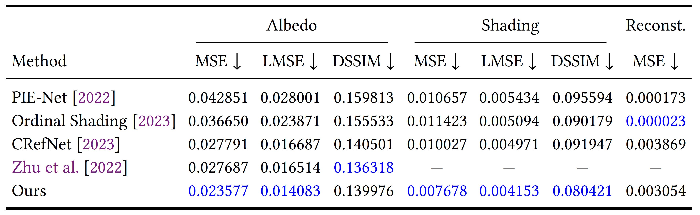
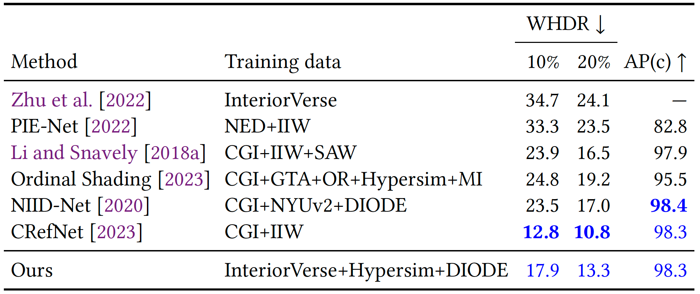

# Intrinsic Image Decomposition Evaluation

Code for evaluating intrinsic image decomposition methods on the IIW and ARAP benchmarks, used in the papers [CRefNet](https://github.com/JundanLuo/CRefNet) and [IntrinsicDiffusion](https://github.com/JundanLuo/IntrinsicDiffusion).

## Dependencies
See [`install.sh`](install.sh) for dependency versions.

## Benchmarks and Results
- ARAP benchmark: ["As R[ealistic] As Possible" dataset for imaging applications](https://perso.liris.cnrs.fr/nbonneel/intrinsicstar/ground_truth/)
- IIW benchmark: [Intrinsic Images in the Wild](http://opensurfaces.cs.cornell.edu/intrinsic/#)
- Precomputed results:
  - `Luo_2024_IntrinsicDiffusion`: [Google Drive](https://drive.google.com/drive/folders/1JEQwn5M0eDa44xvb6NEFlNlbd9JTWaDH?usp=drive_link)
  - `Luo_2023_CRefNet`: [Google Drive](https://drive.google.com/drive/folders/1nml_g_vl3mR2Iaq6hZ-9xRGhd0yPHLlb?usp=drive_link)
  - `Luo_2020_NIID-Net`: [Google Drive](https://drive.google.com/file/d/10NHd0QwuY6JxDN3OGy7gzwyMpRtkRxgs/view?usp=drive_link) 
    ( no ARAP results  since this model trained on it )

## Project Structure
Download benchmark datasets into `data/` and precomputed results into `previous_works/`, then organize them following the structure below.

<details>
<summary>Click to expand project structure</summary>

```text
intrinsic-image-eval project
├── benchmark/
├── data/
│   ├── ARAP/
│   │   ├── input/
│   │   │   ├── alley.png
│   │   │   └── ...
│   │   ├── mask/
│   │   │   ├── alley_alpha.png
│   │   │   └── ...
│   │   ├── reflectance/
│   │   │   ├── alley_albedo.png
│   │   │   └── ...
│   │   └── shading/
│   │       ├── alley_shading.png
│   │       └── ...
│   └── iiw-dataset/
│       └── data/
│           ├── 54.png
│           ├── 54.json
│           └── ...
├── previous_works/
│   ├── Luo_2020_NIID-Net/
│   │   └── IIW_test_low_resolution/
│   │       └── raw/
│   │           ├── 54_pred_R.npy
│   │           └── ...
│   ├── Luo_2023_CRefNet/
│   │   └── final_real/
│   │       ├── ARAP/
│   │       │   ├── alley_light0_r.npy
│   │       │   └── ...
│   │       └── IIW/
│   │           └── low-resolution/
│   │               └── raw/
│   │                   ├── 54_r.npy
│   │                   └── ...
│   └── Luo_2024_IntrinsicDiffusion/
│       ├── ARAP/
│       │   └── evaluate_folder/
│       └── IIW_test_low_resolution/
│           └── evaluate_folder/
├── compute_dense_metrics.py
└── ...
```

</details>

## Run Evaluation
### ARAP Benchmark
Example command:
```bash
python compute_dense_metrics.py --method Luo_2024_IntrinsicDiffusion
```
Results in our paper:



Optional arguments:
- `--dataset ARAP`
- `--data_dir ./data/ARAP`
- `--outdir ./out/compute_dense_errors`
- `--log_interval 20`

### IIW Benchmark
Example command:
```bash
python compute_iiw_whdr.py --method Luo_2024_IntrinsicDiffusion --t 0.2
```

Results in our paper:



Optional arguments:
- `--t 0.2`: the equality threshold for WHDR. We report results with both `0.1` and `0.2`.
- `--color_space linear-rgb`
- `--outdir ./out/compute_iiw_whdr`


## Citation
If you find this code useful, please cite:

```bibtex
@article{luo2023crefnet,
  title={CRefNet: Learning Consistent Reflectance Estimation With a Decoder-Sharing Transformer},
  author={Luo, Jundan and Zhao, Nanxuan and Li, Wenbin and Richardt, Christian},
  journal={IEEE Transactions on Visualization and Computer Graphics},
  year={2023},
  publisher={IEEE}
}
```

and

```bibtex
@inproceedings{Luo2024IntrinsicDiffusion,
      author    = {Luo, Jundan and Ceylan, Duygu and Yoon, Jae Shin and Zhao, Nanxuan and Philip, Julien and Fr{\"u}hst{\"u}ck, Anna and Li, Wenbin and Richardt, Christian and Wang, Tuanfeng Y.},
      title     = {{IntrinsicDiffusion}: Joint Intrinsic Layers from Latent Diffusion Models},
      booktitle = {SIGGRAPH 2024 Conference Papers},
      year      = {2024},
      doi       = {10.1145/3641519.3657472},
      url       = {https://intrinsicdiffusion.github.io},
    }
```

### Contact
For questions, please contact Jundan Luo: `jundanluo22@gmail.com`.

Glad to include precomputed results from other methods in this repository.
